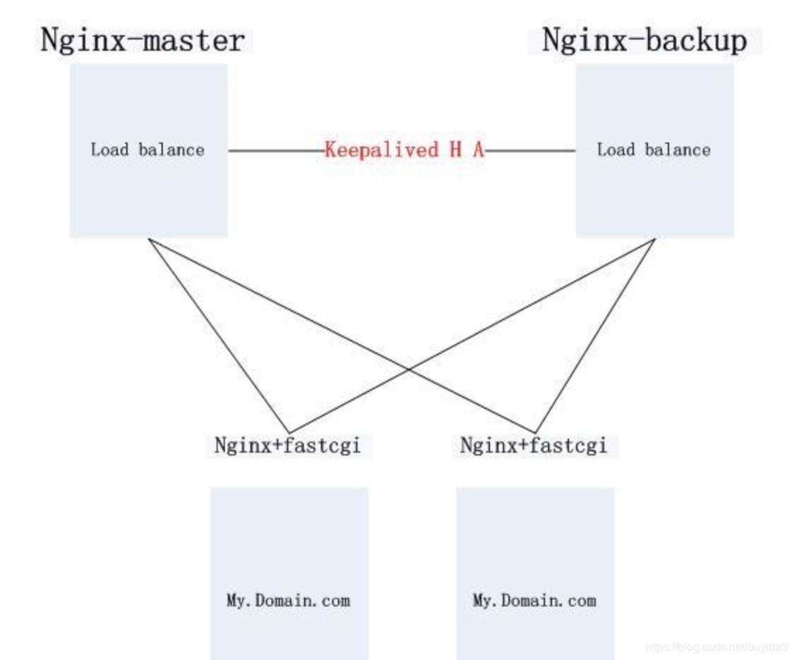

# Nginx+Keepalived实现高可用

## 本章导读
- 通过前面三个章节，应该已经知道什么情况下需要用到nginx、怎么在相应的平台安装nginx、和怎么实现一个简单的反向代理和负载均衡了。
- 对于我来说，我觉得已经入了门了，可以对没有听过nginx的同学炫耀一下了：）
- 但在真实生产环境中，这还远远不够，虽然你的nginx后方可以有几十、甚至上百台应用服务器，任意一台或者数台挂了也不用过于紧张，nginx会负载到其他可用的服务器
- 不过，万一这台nginx挂了呢？
- 所以，nginx一台是不够的，至少需要两台，才能基本保证高可用
- 但是问题来了，两台nginx怎么负载呢？
答案是通过keepalived。

## 本章要点

- 两台nginx，始终只是一台工作，这个和我们之前理解的负载均衡的概念不同
- 负载的核心是提供一个虚拟ip，这个虚拟ip是通过keepalived实现的，知道这个非常关键
- 当然，虚拟ip可能也可以通过网卡等技术实现，但是这个不是这里关注的
- 实现nginx的高可用，除了keepalived，还有其他的技术，比如硬件负载F5等等，也可以增加lvs或者haproxy这些多层代理、负载。
- 但是，据我了解，nginx+keepalived是比较成熟、广泛使用的，也是比较简单的，所以我这里主要写这个。

## 环境准备

```
192.168.0.221：nginx + keepalived master
192.168.0.222：nginx + keepalived backup
192.168.0.223：tomcat
192.168.0.224：tomcat
```
虚拟ip(VIP):192.168.0.200，对外提供服务的ip，也可称作浮动ip

各个组件之间的关系图如下：




### tomcat做应用服务器
### nginx做负载均衡

`nginx.conf`内容如下

```properties
user  root;            #运行用户
worker_processes  1;        #启动进程,通常设置成和cpu的数量相等

#全局错误日志及PID文件
error_log  /usr/local/nginx/logs/error.log;
error_log  /usr/local/nginx/logs/error.log  notice;
error_log  /usr/local/nginx/logs/error.log  info;
pid        /usr/local/nginx/logs/nginx.pid;

# 工作模式及连接数上线
events
{
    use epoll;            #epoll是多路复用IO(I/O Multiplexing)中的一种方式,但是仅用于linux2.6以上内核,可以大大提高nginx的性能

    worker_connections  1024;    #单个后台worker process进程的最大并发链接数
}

#设定http服务器,利用它的反向代理功能提供负载均衡支持
http
{
    include       mime.types;
    default_type  application/octet-stream;

    #设定请求缓冲
    server_names_hash_bucket_size  128;
    client_header_buffer_size   32K;
    large_client_header_buffers  4 32k;
    # client_max_body_size   8m;

    #sendfile 指令指定 nginx 是否调用 sendfile 函数（zero copy 方式）来输出文件，对于普通应用，
    #必须设为 on,如果用来进行下载等应用磁盘IO重负载应用，可设置为 off，以平衡磁盘与网络I/O处理速度，降低系统的uptime.
    sendfile        on;
    tcp_nopush     on;
    tcp_nodelay    on;

    #连接超时时间
    keepalive_timeout  65;

    #开启gzip压缩，降低传输流量
    gzip  on;
    gzip_min_length    1k;
    gzip_buffers    4 16k;
    gzip_http_version  1.1;
    gzip_comp_level  2;
    gzip_types  text/plain application/x-javascript text/css  application/xml;
    gzip_vary on;

    #添加tomcat列表，真实应用服务器都放在这
    upstream tomcat_pool
    {
       #server tomcat地址:端口号 weight表示权值，权值越大，被分配的几率越大;
　　　　server 192.168.0.223:8080 weight=4 max_fails=2 fail_timeout=30s;
    　 server 192.168.0.224:8080 weight=4 max_fails=2 fail_timeout=30s;
    }

    server
    {
        listen       80;        #监听端口
        server_name  localhost;

    #默认请求设置
    location / {
        proxy_pass http://tomcat_pool;    #转向tomcat处理
    }

    #所有的jsp页面均由tomcat处理
    location ~ \.(jsp|jspx|dp)?$
    {
        proxy_set_header Host $host;
        proxy_set_header X-Real-IP $remote_addr;
        proxy_pass http://tomcat_pool;    #转向tomcat处理
    }

    #所有的静态文件直接读取不经过tomcat,nginx自己处理
    location ~ .*\.(htm|html|gif|jpg|jpeg|png|bmp|swf|ioc|rar|zip|txt|flv|mid|doc|ppt|pdf|xls|mp3|wma)$
    {
        expires  30d;
    }
    location ~ .*\.(js|css)?$
    {
       expires  1h;
    }

    #定义错误提示页面
        error_page   500 502 503 504  /50x.html;
        location = /50x.html {
            root   html;
        }

    }
}
```

主从nginx的配置文件完全一样，`nginx.conf`配置可复杂可简单，大家根据自己的情况自行配置，照搬上述配置也是可以的。
配置好后，启动nginx，路径要写自己的
两台nginx服务器服务正常，此时是没有主从之分的，两者级别一样高，当配置keepalived之后就有了主从之分了。

### keepalived实现nginx高可用(HA)

keepalived的安装本文就不讲述了，具体可到keepalived官网下载，把tar包放到主机上解压，通过configure、make、make install的经典三步曲安装（和nginx的安装很像），如果遇到openssl等包没有的问题，也安装上就解决了。具体可以网上找keepalived的安装文章。

keepalived作用其实在第一张图中已经有所体现，主要起到两个作用：实现VIP到本地ip的映射； 以及检测nginx状态。

master上的 `keepalived.conf` 内容如下：

```
global_defs {
    notification_email {
        ouyida3@gmail.com
    }
    notification_email_from sns-lvs@gmail.com
    smtp_server smtp.hysec.com
    smtp_connection_timeout 30
    router_id nginx_master        # 设置nginx master的id，在一个网络应该是唯一的
}
vrrp_script chk_http_port {
    script "/usr/local/src/check_nginx_pid.sh"    #最后手动执行下此脚本，以确保此脚本能够正常执行
    interval 2                          #（检测脚本执行的间隔，单位是秒）
    weight 2
}
vrrp_instance VI_1 {
    state MASTER            # 指定keepalived的角色，MASTER为主，BACKUP为备
    interface eth0            # 当前进行vrrp通讯的网络接口卡(当前centos的网卡)
    virtual_router_id 66        # 虚拟路由编号，主从要一直
    priority 100            # 优先级，数值越大，获取处理请求的优先级越高
    advert_int 1            # 检查间隔，默认为1s(vrrp组播周期秒数)
    authentication {
        auth_type PASS
        auth_pass 1111
    }
    track_script {
    chk_http_port            #（调用检测脚本）
    }
    virtual_ipaddress {
        192.168.0.200            # 定义虚拟ip(VIP)，可多设，每行一个
    }
}
```

backup上的 `keepalived.conf` 内容如下：

```
global_defs {
    notification_email {
        ouyida3@gmail.com
    }
    notification_email_from sns-lvs@gmail.com
    smtp_server smtp.hysec.com
    smtp_connection_timeout 30
    router_id nginx_backup              # 设置nginx backup的id，在一个网络应该是唯一的
}
vrrp_script chk_http_port {
    script "/usr/local/src/check_nginx_pid.sh"
    interval 2                          #（检测脚本执行的间隔）
    weight 2
}
vrrp_instance VI_1 {
    state BACKUP                        # 指定keepalived的角色，MASTER为主，BACKUP为备
    interface eth0                      # 当前进行vrrp通讯的网络接口卡(当前centos的网卡)
    virtual_router_id 66                # 虚拟路由编号，主从要一直
    priority 99                         # 优先级，数值越大，获取处理请求的优先级越高
    advert_int 1                        # 检查间隔，默认为1s(vrrp组播周期秒数)
    authentication {
        auth_type PASS
        auth_pass 1111
    }
    track_script {
        chk_http_port                   #（调用检测脚本）
    }
    virtual_ipaddress {
        192.168.0.200                   # 定义虚拟ip(VIP)，可多设，每行一个
    }
}
```

nginx检测脚本 `check_nginx_pid.sh` 内容如下：

```sh
#!/bin/bash
A=`ps -C nginx --no-header |wc -l`
if [ $A -eq 0 ];then
    /usr/local/nginx/sbin/nginx                #重启nginx
    if [ `ps -C nginx --no-header |wc -l` -eq 0 ];then    #nginx重启失败
        exit 1
    else
        exit 0
    fi
else
    exit 0
fi
```

启动 `keepalived`

```bash
# service keepalived start
```

访问VIP，就会转向到nginx。

如果有时间，可以看下keepalived的日志信息，加深印象。

- master（192.168.0.221）
- backup（192.168.0.222）

当我们把 master 上的 keepalived 停掉（模拟宕机），再来看下 keepalived 日志

- 原master（192.168.0.221）
- 原backup（192.168.0.222）

通过VIP可以正常访问服务，前端请求感受不到后端nginx的切换；重新唤醒原master（192.168.0.221）的测试这里就不进行了，大家自行测试。

## 注意点

- 负载均衡最好进行多浏览器测试，有些浏览器会缓存，会产生没有负载均衡的效果，例如我这次测试中谷歌浏览器就出现了类似的情况(还没搞清楚是否是缓存的原因)，火狐，360、IE浏览器都是正常的负载均衡效果。
- 请求走向

访问虚拟IP(VIP)，keepalived将请求映射到本地nginx，nginx将请求转发至tomcat，例如：http://192.168.0.200/myWeb/， 被映射成 http://192.168.0.221/myWeb/， 端口是80，而221上nginx的端口正好是80；映射到nginx上后，nginx再进行请求的转发。

keepalived服务器的ip情况:

VIP总会在keepalived服务器中的某一台上，也只会在其中的某一台上；VIP绑定的服务器上的nginx就是master，当VIP所在的服务器宕机了，keepalived会将VIP转移到backup上，并将backup提升为master。

- VIP也称浮动ip，是公网ip，与域名进行映射，对外提供服务； 其他ip一般而言都是内网ip， 外部是直接访问不了的
